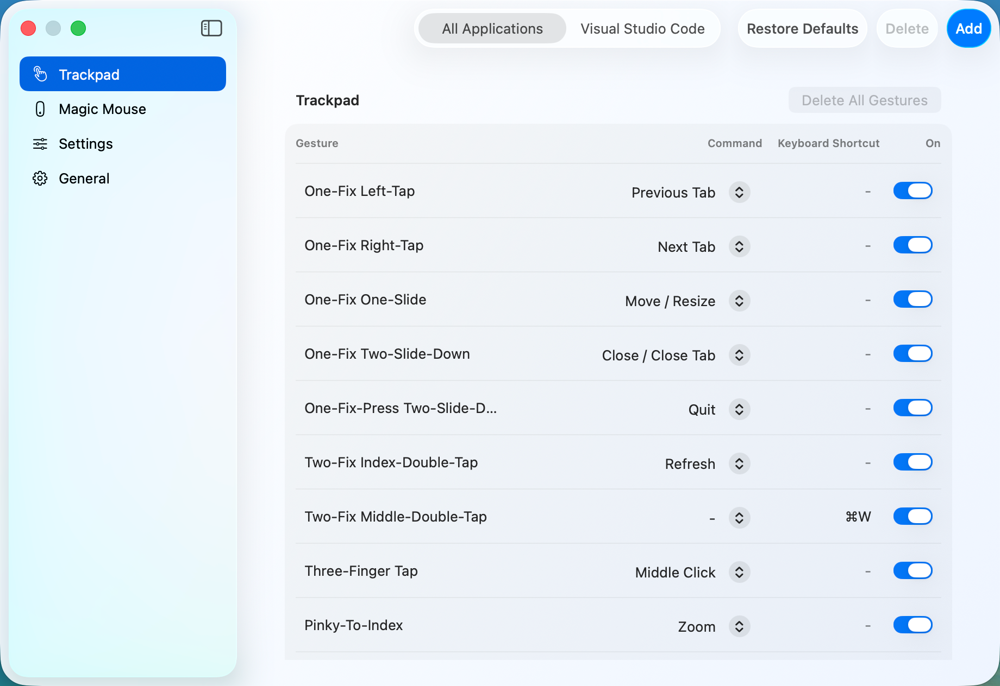

# Jitouch Modern

**Jitouch Modern** is a macOS application that expands the set of multi-touch gestures for MacBook trackpads, Magic Trackpad, and Magic Mouse. It brings the original Jitouch idea to a modern Swift app with a refreshed preferences window, per-application gesture profiles, iCloud sync, localization, and Developer ID distribution.

Jitouch gestures make frequent window, browser, and app actions feel close at hand: changing tabs, closing windows, resizing windows, launching system views, sending keyboard shortcuts, and more.

## Features

- Trackpad and Magic Mouse gesture customization.
- Per-application profiles, including an "All Applications" fallback.
- Built-in action commands and custom keyboard shortcuts.
- Import and export gesture settings.
- iCloud settings sync.
- Light, dark, and system appearance modes.
- Localized interface for English, Simplified Chinese, Traditional Chinese, Japanese, Korean, Russian, Spanish, French, Portuguese, Thai, Arabic, Bengali, German, and Hindi.
- Notarized Developer ID builds for non-App Store distribution.

## Installation

Download the notarized release zip, unzip it, move `Jitouch Modern.app` to your Applications folder, and open it.

On first launch, macOS may ask for Accessibility permission. Jitouch needs this permission to observe gestures and perform configured actions.

## Troubleshooting

When opening Jitouch for the first time, macOS should prompt you to grant Accessibility permission. If the prompt does not appear, grant it manually.

### To Manually Give Jitouch Permission

- Open System Settings and go to "Privacy & Security -> Accessibility".
- Add `Jitouch Modern.app` to the list and enable it.
- Restart Jitouch Modern after changing the permission.

If gestures still do not respond, quit and reopen Jitouch Modern, then confirm that the app is enabled in the menu bar and that the target device is enabled in Settings.

## Build From Source

1. Open `jitouch/Jitouch/Jitouch.xcodeproj` in Xcode.
2. Select the `Jitouch` scheme.
3. Build the project. For best performance, set the Build Configuration to Release.
4. Move the built `Jitouch Modern.app` to your Applications folder.

Developer ID release builds require a Developer ID Application certificate and a provisioning profile that matches `com.JitouchModern` and includes the iCloud key-value storage entitlement.

## License

Copyright (c) Supasorn Suwajanakorn and Sukolsak Sakshuwong. All rights reserved.  
Modified work copyright (c) Aaron Kollasch. All rights reserved.

Licensed under the [GNU General Public License v3.0](LICENSE).
